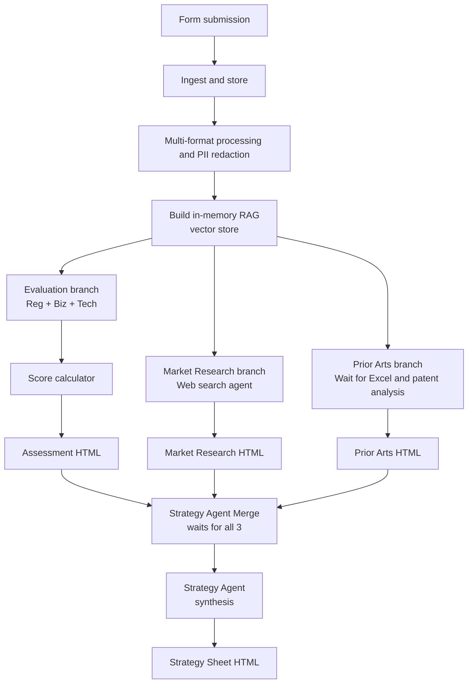
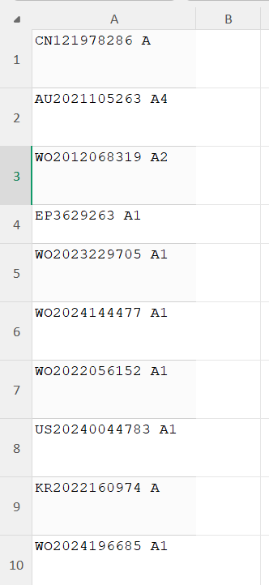
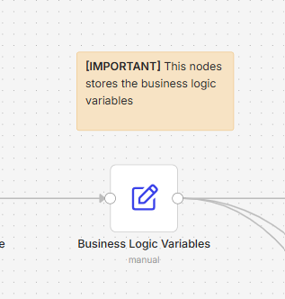

# CommercReady: A Technology Transfer n8n Workflow — Business Logic

| Item              | Details                                                                                                                                                                                                                                                                                                                                                                               |
| ----------------- | ------------------------------------------------------------------------------------------------------------------------------------------------------------------------------------------------------------------------------------------------------------------------------------------------------------------------------------------------------------------------------------- |
| Workflow name     | CommercReady: A Technology Transfer n8n Workflow                                                                                                                                                                                                                                                                                                                                     |
| Purpose           | End-to-end technology assessment pipeline for a university Research Office. A Principal Investigator (PI) submits a research disclosure (form + supporting documents); the workflow redacts PII, builds a RAG knowledge base, runs multiple specialised AI evaluation agents in parallel, computes a weighted readiness score, and produces an actionable commercialisation strategy. |
| Authoring context | Reverse-engineered from the n8n workflow JSON. All credentials and node IDs have been stripped from the source; this document describes only the business logic.                                                                                                                                                                                                                      |

---

## 0. Methodological Frameworks

The workflow's scoring logic is not invented from scratch — it operationalises three published technology-transfer methodologies. Every dimension the agents score, and every threshold the code node applies, traces back to one of these sources:

| Framework                                        | Source                                                                           | Used for                                              | Dimensions / scales                                                                              |
| ------------------------------------------------ | -------------------------------------------------------------------------------- | ----------------------------------------------------- | ------------------------------------------------------------------------------------------------ |
| **KTH Innovation Readiness Level™ (IRL)** | KTH Innovation / KTH Royal Institute of Technology                               | Core six-dimension commercial readiness scoring       | TRL, IPRL, TMRL, FRL, CRL, BRL (each 1–9)                                                       |
| **TT&E Framework**                         | Sebastian (2026)                                                                 | Market readiness dimension and translation-risk logic | MRL (1–9); informs the ρ translation-risk concept that compares technology vs. market maturity |
| **Kobos TRM (Technology Roadmap)**         | Kobos et al. — regulatory traction / policy support strand of the TRM framework | Regulatory readiness dimension                        | RRL (1–5), with explicit mapping from policy support / regulatory traction to a 5-level scale   |

The three frameworks are complementary, not redundant: KTH IRL covers the six "classic" readiness dimensions; TT&E adds the market-side lens (MRL) and the explicit concept of a *translation gap* between technology and market maturity, which the workflow formalises as ρ; and Kobos TRM contributes the regulatory/policy dimension that KTH IRL does not natively cover. The workflow's seven scored dimensions (TRL, IPRL, TMRL, FRL, CRL, BRL, MRL) plus the regulatory dimension (RRL) span all three frameworks.

A brief note on scope: the workflow's `Business Logic Variables` node hard-codes the weights and thresholds (see §6.2), so any change to the underlying methodology must be reflected there. The agent prompts embed the rubric text directly, so they too must be updated if a framework is revised.

---

## 1. High-Level Overview

The workflow is a six-phase pipeline that turns a confidential research disclosure into a structured investment-grade assessment. The PI provides the inputs through a web form (project metadata + uploaded documents + selected service modules). From that point on, the workflow is fully autonomous until it pauses for one human-in-the-loop checkpoint: the submission of a prior-arts Excel sheet.

The intellectual core of the workflow is the **KTH Innovation Readiness Level (IRL) framework**, supplemented by the **TT&E Framework (Sebastian, 2026)** for market readiness and the **Kobos TRM framework** for regulatory traction. Together they form a seven-dimension scoring system that measures how ready a project is for commercialisation. The workflow does not just ask an LLM to "evaluate the project"; it forces specialized agents to score against published rubrics: `Tech Readiness Evaluation Agent` scores TRL, IPRL, TMRL, and FRL; `Business Evaluation Agent` scores CRL, BRL, and MRL; `Regulatory & Certification Strategy Agent` scores RRL. A deterministic code node then combines those scores with a weighted-sum formula, applies translation-risk and maturity-delta penalties, and emits a recommendation label (Commercialise / Hold / Stop). A separate Strategy Agent then translates the numeric verdict into a commercialisation roadmap, but is explicitly forbidden from re-computing any score.

The full pipeline shape:



The PI can selectively request `Project Evaluation`, `Market Research`, and `Prior Arts`. These three service modules are independently gated by `If` nodes against the form's `services` checkbox array. `Strategy` should be understood differently: when it is selected, the workflow executes the upstream analysis needed for final strategy synthesis rather than behaving as a standalone lightweight branch.

---

## 2. Trigger & Submission Contract

The workflow starts with an n8n Form Trigger titled **"Technology Assessment Workflow"**. The form is the only human input surface for the entire run.

**Form fields:**

| Field                        | Type             | Required | Notes                                                                                                           |
| ---------------------------- | ---------------- | -------- | --------------------------------------------------------------------------------------------------------------- |
| Project Title                | text             | yes      | Used to build the folder name and the project ID                                                                |
| Primary Inventors            | text             | yes      | Stored in`submission_info.json`                                                                               |
| Technology Category          | text             | yes      | Becomes`tech_field` and is forwarded to every agent                                                           |
| Brief Description            | textarea         | no       | Optional context for agents                                                                                     |
| Services to Do               | checkbox (multi) | yes      | Options: Project Evaluation / Prior Arts / Market Research / Strategy. Drives the gating`If` nodes downstream |
| Upload Documents             | file (multi)     | yes      | Accepted:`.docx, .doc, .pptx, .ppt, .pdf, .jpg, .jpeg, .png`                                                  |
| Confidentiality confirmation | checkbox         | yes      | Single option`True`; legal gate                                                                               |

A code node (`Parse Form & Normalize Binary`) immediately normalises the form payload:

- It builds a `folder_name` from the current UTC timestamp + a slugified project title (e.g. `20260706153000_My_Quantum_Sensor`).
- It establishes `base_path = confidential_volume/<folder_name>` as the on-disk root for this submission.
- It explodes the multi-file binary payload into N items (one per uploaded file), each carrying metadata `file_name`, `mime_type`, `category`, `project_title`, `primary_inventors`, `services`, plus the original `binary.data`.
- It saves a `submission_info.json` snapshot of the form for audit purposes.

The folder layout created on disk is:

```
confidential_volume/<timestamp>_<projectTitle>/
├── 00_Admin/               # intake metadata and summarization artifacts
├── 01_Raw/                 # original uploaded files
├── 02_Redacted/            # PII-redacted text
├── 03_Assessment/          # HTML reports (evaluation, market, prior arts)
└── 04_Strategy/            # HTML strategy sheet
```

---

## 3. Phase 1 — Multi-format Processing & PII Redaction

After ingestion, a `Format Router` switch node routes each uploaded file by extension into one of three parallel processing branches. The three branches converge at the `Document Collector` merge node, which feeds the redaction loop. This is the most operationally complex phase of the workflow because it must handle heterogeneous file types while guaranteeing that no PII ever reaches the LLM agents.

### 3.1 Image branch

1. `Loop Over Images` (Split In Batches) iterates one image at a time.
2. `Base64 Encoding` converts the binary to a data URL.
3. `LLM Image Analysis` is an HTTP request to an OpenAI-compatible vision endpoint (the model in the configured payload is a Qwen 3.7 multimodal model). The system prompt asks the model to *describe the image in detail, extract all visible text, describe any diagrams/charts/figures, and be precise and structured*.
4. `Combine LLM Results with File Data` merges the LLM description back with the file metadata.
5. After the loop completes, `Aggregate` consolidates all image descriptions, and `Write Image Description Markdown to Drive` writes a single Markdown file under `01_Raw/` summarising every image. This Markdown later becomes part of the RAG corpus.

The image branch is the mechanism by which figures, slides exported as images, and photographs of prototypes are made text-searchable for the downstream RAG system.

### 3.2 PDF branch

PDFs require special handling because some are text-layer PDFs and others are scanned images.

1. `Loop Over PDFs` iterates PDFs one at a time.
2. `PDF Metadata Extraction` (n8n pdf-page-extract node) pulls per-page text and page count.
3. An `If` node applies a heuristic: it computes `pages.flat().join(' ').trim().split(/\s+/).length` (total word count) and compares it against `30 × totalPages`. If the word count is below this threshold (i.e. less than 30 words per page on average), the PDF is classified as **scanned**.
4. **Scanned PDFs** are written into a `scanned_pdf.json` manifest (saved to `01_Raw/`) so they can be flagged for the human reviewer. They are not OCR'd in this workflow.
5. **Text PDFs** fall through to `Loop Over PDFs for Conversion`, which uses the `@mazix/n8n-nodes-converter-documents` converter to turn the PDF into structured JSON.

### 3.3 Office documents branch

`Loop Over Documents for Conversion` handles `.docx`, `.doc`, `.pptx`, `.ppt`, `.xlsx`, `.xls`, `.csv`, `.txt`. The same `@mazix` converter node turns each into JSON.

### 3.4 PII redaction (Presidio, bilingual)

The redacted JSON outputs from all three branches are merged at `Document Collector`, then a single `Loop Over Document and PDF(s) for Redaction` iterates each document. For each document:

1. `Text Cleaner` normalises whitespace and strips conversion artefacts.
2. `Detect Language` identifies the dominant language (English `en` vs everything else, treated as Chinese).
3. `If it is English only` branches the flow:
   - **English path:** `Prepare Presidio Request (English)` → `Presidio Anaylze (English)` (calls Presidio's analyzer endpoint to identify PII entities) → `Prepare Anonymizer Request (English)` → `Presidio Anonymize (English)` (replaces entities with `<ENTITY_TYPE>` placeholders) → `Tidy Up (English)` → `Write Redacted Docs (English)`.
   - **Chinese path:** Same sequence using the Chinese Presidio pipeline → `Tidy Up (Chinese)` → `Write Redacted Docs (Chinese)`.

The redacted text is written to `02_Redacted/`. Only these redacted files are ever read back into the RAG system; the raw originals never touch an LLM. This is the workflow's primary confidentiality safeguard and is non-negotiable: every downstream agent operates on redacted text only.

### 3.5 Phase 2 gate

`Gate for Phase 3` is a `Merge` node in `chooseBranch` mode that waits for both the redaction loop *and* the image description writer to complete before releasing the run into Phase 3. This guarantees the RAG corpus is complete before any agent queries it.

---

## 4. Phase 2.5 — In-Memory RAG Construction

A single chain builds the agent-facing knowledge base:

1. `Trigger Gate` (a `Merge` waiting on the Phase 3 gate) releases the run.
2. `Read Redacted Files from Disk` loads every file under `02_Redacted/` into n8n items.
3. `Data Loader` (LangChain documentDefaultDataLoader) wraps each file's content as a `Document` with metadata.
4. `In-memory RAG Embeddings` (OpenAI embeddings) generates vectors.
5. `In-memory RAG` (LangChain vectorStoreInMemory) ingests the documents + embeddings.
6. `Vectore Store Complete Trigger` (a Merge in `chooseBranch` mode) fires `Business Logic Variables`, which loads the scoring constants (weights, thresholds, penalty multipliers) into the workflow's expression scope.

The vector store is exposed to every downstream agent through a single LangChain tool called `Query Data Tool`. Agents retrieve relevant snippets from the redacted corpus by issuing natural-language queries; they never see raw uploads.

> ⚠️ Note: the vector store is **in-memory only**. It lives for the duration of the execution and is not persisted. Every run rebuilds it from the redacted files on disk.

---

## 5. Phase 3 — Parallel AI Evaluation

After the vector store is built, the workflow fans out into up to three parallel evaluation branches. Each branch is gated by an `If` node that checks whether the corresponding service was selected on the form, with `Strategy` treated as a full-run option that requires the upstream analysis branches:

| Branch          | Gate node                      | Condition                                                              | Releases                                         |
| --------------- | ------------------------------ | ---------------------------------------------------------------------- | ------------------------------------------------ |
| Evaluation      | `Evaluation Input Gate`      | `services` array contains `"Project Evaluation"` or `"Strategy"` | 3 sub-agents in parallel                         |
| Market Research | `Market Research Input Gate` | `services` array contains `"Market Research"` or `"Strategy"`    | Market Research Agent                            |
| Prior Arts      | `Prior Arts Input Gate`      | `services` array contains `"Prior Arts"` or `"Strategy"`         | Tech Describer → human wait → Prior Arts Agent |

If a service is not selected, its gate emits nothing on the truthy branch and the downstream merge node simply never receives that input. In operational terms, a PI can request Evaluation, Market Research, or Prior Arts independently, while selecting Strategy causes the workflow to run the full upstream set needed by the Strategy Agent.

### 5.1 Evaluation branch (3 parallel agents)

All three agents share the same pattern:

- An OpenRouter chat model node (`@n8n/n8n-nodes-langchain.lmChatOpenRouter`) provides the LLM backend.
- A `Structured Output Parser` node enforces a strict JSON schema on the agent's response.
- The agent has access to the `Query Data Tool` so it can retrieve relevant snippets from the redacted corpus.
- The system message embeds the full rubric for each dimension being scored, and instructs the agent to *be conservative, quote evidence directly from the project documents, and output only valid JSON*.

#### 5.1.1 Regulatory & Certification Strategy Agent

Scores the project on the **Regulatory Readiness Level (RRL)** — a 5-level scale derived from the regulatory traction / policy support strand of the **Kobos TRM (Technology Roadmap) framework** (see §0):

| RRL | Meaning                                                                                     |
| --- | ------------------------------------------------------------------------------------------- |
| 1   | Initial awareness / hypothesis of possible regulatory needs (no systematic mapping)         |
| 2   | Regulatory landscape and key barriers identified                                            |
| 3   | Regulatory pathway defined, classified, and validated (gaps analyzed)                       |
| 4   | Approval / submission pathway secured or advanced (evidence submitted, positive engagement) |
| 5   | Full regulatory endorsement / approvals operational and scalable across markets             |

The agent also identifies key regulations in the US, EU, China, and other relevant markets, recommends high-value certifications, and suggests concrete next steps to advance the RRL. The agent is explicitly told to be *general and adaptable* — it must not assume the project is in AI, medical devices, or biotech.

#### 5.1.2 Business Evaluation Agent

Scores three dimensions from the KTH framework:

- **CRL (Customer Readiness Level):** 9 levels from "Hypothesis of possible needs" (1) to "Widespread scalable sales with large growing user base" (9).
- **BRL (Business Readiness Level):** 9 levels from "Vague business idea and market insight" (1) to "Business model proven on profit, growth, and scalability" (9).
- **MRL (Market Readiness Level):** drawn from the **TT&E Framework (Sebastian, 2026)** — see §0. 9 levels from "Hypothesis about market needs" (1) to "Product testing or test sales in progress" (9). The TT&E framework is also the source of the translation-risk concept (ρ) that compares TRL against MRL — see §6.3.

**MRL Rubric (TT&E):**

1. Level 1: Hypothesis about market needs.
2. Level 2: Existing solutions known + IP strategy formulated.
3. Level 3: Market overview and size described + competitors identified.
4. Level 4: Competition analyzed + small-scale acceptance tested.
5. Level 5: Functions tested with customers + business concept described + needs confirmed.
6. Level 6: Detailed market picture + commercialization demonstrated + obstacles identified.
7. Level 7: Significant market share opportunity proven + value-confirming collaborations.
8. Level 8: Documented business/pricing model with confirmed sales potential.
9. Level 9: Product testing or test sales in progress.

This MRL rubric is self-defined in workflow configuration, so users can adjust it to fit local evaluation policy. Because MRL feeds directly into both `maturity_delta` and `ρ`, changing rubric definitions or scoring guidance will change downstream penalty behavior.

#### 5.1.3 Tech Readiness Evaluation Agent

Scores four dimensions from the KTH framework:

- **TRL (Technology Readiness Level):** the canonical 1–9 NASA/KTH scale, from "Vague idea" (1) to "Complete technology scalable and proven in actual operations by several users" (9).
- **IPRL (IP Readiness Level):** from "Only hypothesis of possible IPR" (1) to "IPR strategy proven to create value. Key IPR granted in multiple relevant countries" (9).
- **TMRL (Team Readiness Level):** from "Individual lacking key competencies" (1) to "High-performing organization with continuous improvement and aligned incentives" (9).
- **FRL (Financial Readiness Level):** from "Little insight into funding needs" (1) to "Long-term funding strategy with secured interest for next stage" (9).

This agent does **not** score MRL. MRL is scored by the `Business Evaluation Agent`.

The agent is told to *be extremely conservative* and to quote evidence directly from the project documents. The "conservative" instruction is deliberate — the workflow's author clearly wants to avoid inflated self-assessments.

The three agents converge at `Evaluation Gate`, a 3-input `Merge` node that releases once all three have produced output.

### 5.2 Market Research branch

A single agent — `Market Research Agent` — handles the entire market research deliverable. The system message is the longest in the workflow (~14k characters) and prescribes a rigorous research methodology:

- **Anti-hallucination enforcement:** every quantitative claim (market size, CAGR, funding amount, competitor fact) MUST include an inline citation in the exact format `[Organization Name, Year](https://specific-url-to-specific-page)`. URLs must link to a specific page, not a domain root. Unsourced claims are explicitly treated as hallucinations.
- **Recency window:** all quantitative data must come from the current year or the two immediately preceding calendar years. Older data may only be used as a historical baseline, explicitly caveated.
- **Source priority hierarchy:** primary government/official statistics > company primary disclosures (SEC EDGAR, investor relations) > recognised market intelligence (Grand View, MarketsandMarkets, Statista, IDC, Gartner) > peer-reviewed papers > primary policy sources.
- **Five mandatory research dimensions:**
  1. Market Sizing & Opportunity (TAM/SAM/SOM with explicit assumptions and cross-checks)
  2. Ecological Niche & Ecosystem Positioning (value chain role, complementors, substitutes)
  3. Competitive & Alternatives Analysis (direct + indirect competitors, defensibility signals)
  4. Investor & Funding Framing (why now, comparables, red flags sophisticated investors may raise)
  5. Global Policy & Regulatory Landscape (US/EU/China/Japan/India/UK, classified as Strongly Supportive → Strongly Opposing, with budget/timeline/status for each)
- **Contrarian evidence required:** the agent must actively include downside scenarios, adoption friction, competitive responses, policy reversal risk.
- **Fact/Inference/Recommendation separation:** the agent must explicitly label which is which.
- **Output:** strict JSON only — no markdown, no preamble, no postscript.

The agent has two tools: the `Query Data Tool` (RAG over the redacted corpus) and a `Web Search Tool` (an HTTP request tool backed by a Qwen-with-Perplexity-Web-Search model on OpenRouter). The web search tool is the agent's only source of external market data.

After the agent completes, `Generate Market Research Report` renders the JSON into a colour-coded HTML report saved to `03_Assessment/Market_Research_Report.html`. The report generator renders inline source links as clickable anchors directly where each claim is made (v4.1 change from v3 — the separate "Sources" section was removed in favour of inline links).

### 5.3 Prior Arts branch (human-in-the-loop)

The Prior Arts branch is unique because it requires a human to provide a list of candidate prior-art patents. The flow is:

1. `Prior Arts Input Gate` releases.
2. `Tech Describer` agent writes a ~250-word plain-text description of the research project's theory and innovation. The system message is short: *"Be objective, evidence-based, and faithful to the provided documents. Technology and theory description only, no need to mention the readiness. Must be about 250 words."*
3. `Generate Summarization` saves this output as `00_Admin/technology_summarization.txt`. This file is intended for university staff to support prior-art searching workflows (for example, CAS SciFinder Prior Art) before the patent-list submission step.
4. **`Wait for Prior Arts Subission`** — a `wait` node in `form` resume mode. The workflow pauses execution and expects the operator to open the wait node in n8n and click the `Webform` link shown in the right-side panel; the form does not reliably pop up on its own. The uploaded file should be a new Excel workbook with patent publication numbers entered in column `A`, one per row, with no worksheet renaming required. The PI (or research office staff) must submit this file before the workflow can continue.

  Example Excel format:

  
5. `Extract Publication Number` (an `extractFromFile` node) reads the submitted Excel and extracts the patent numbers.
6. `Parse Excel Extraction` (a code node) normalises the patent numbers into an array.
7. `Prior Arts Analysis Agent` runs. Its system message instructs it to:

- Retrieve full patent details via the `Google Patent HTTP Tool` (an HTTP request tool that queries Google Patents).
- For each patent: summarise core technology theory, identify key innovation points, note target industry/application, and compare to the current project (similarities, differences, overlapping claims, potential novelty impact).
- Rank the patents by similarity to the current project (most → least similar) with reasoning.
- Stay faithful to retrieved patent content and RAG context. Do not speculate.

8. `Generate Prior Arts Anaylsis Report` renders the JSON into an HTML report saved to `03_Assessment/Prior_Arts_Anaylsis_Report.html`.

The `Wait` node is the only place in the workflow where a human is required mid-execution. If the user does not submit the Excel, the workflow remains paused indefinitely (subject to n8n's execution timeout policy).

---

## 6. Phase 4 — Scoring & Assessment Report

Once the Evaluation branch completes (Regulatory + Business + Tech, all three), the workflow runs the deterministic scoring engine.

### 6.1 Merge Evaluation Agent Outputs (code node)

This node receives the three agent outputs (each shaped `{ output: { agent, ...scores } }`), identifies them by keyword (`Regulatory`, `Business`, `Tech`), and extracts the seven dimension scores with sensible fallbacks if an agent failed to emit a particular dimension:

| Dimension | Source agent | Fallback |
| --------- | ------------ | -------- |
| CRL       | Business     | 2        |
| BRL       | Business     | 2        |
| MRL       | Business     | 2        |
| TRL       | Tech         | 5        |
| IPRL      | Tech         | 5        |
| TMRL      | Tech         | 3        |
| FRL       | Tech         | 1        |

### 6.2 Weighted sum

The weighted sum is the workflow's primary readiness score. The weights are loaded from `Business Logic Variables`:

| Dimension | Weight |
| --------- | ------ |
| CRL       | 0.20   |
| TRL       | 0.20   |
| BRL       | 0.20   |
| IPRL      | 0.15   |
| TMRL      | 0.15   |
| FRL       | 0.10   |

Weights sum to 1.0, so the weighted sum is on the same 1–9 scale as the individual dimensions.

```
weighted_sum = CRL·0.20 + TRL·0.20 + BRL·0.20 + IPRL·0.15 + TMRL·0.15 + FRL·0.10
```

### 6.3 Translation risk ρ

ρ measures the gap between technology readiness and market readiness — i.e. how much "translation" work is needed to turn a technical achievement into a market-ready product.

$$
\Delta = \lvert TRL - MRL \rvert
$$

$$
\rho =
\begin{cases}
\dfrac{TRL}{MRL} \cdot e^{(\Delta - 2)}, & MRL > 0 \\
0, & MRL \le 0
\end{cases}
$$

A high ρ means the project is much further along technologically than commercially — a classic "science-project trap" that the workflow is designed to flag explicitly.

### 6.4 Penalty system

Two independent step-function penalties are computed and the **stronger** (lower) multiplier is applied to the weighted sum:

**Translation Risk (ρ) penalty:**

| ρ                                      | Multiplier          |
| --------------------------------------- | ------------------- |
| ρ < 2.0 (no-penalty threshold)         | 1.00                |
| 2.0 ≤ ρ < 4.0 (max-penalty threshold) | 0.80 (TR_PENALTY_1) |
| ρ ≥ 4.0                               | 0.75 (TR_PENALTY_2) |

**Maturity Delta (Δ) penalty:**

| Δ                                      | Multiplier          |
| --------------------------------------- | ------------------- |
| Δ ≤ 2.0 (no-penalty threshold)        | 1.00                |
| 2.0 < Δ ≤ 3.5 (max-penalty threshold) | 0.80 (MD_PENALTY_1) |
| Δ > 3.5                                | 0.75 (MD_PENALTY_2) |

```
penalty_multiplier = min(tr_multiplier, md_multiplier)
penalised_weighted_sum = weighted_sum · penalty_multiplier
```

Only the strongest penalty applies — they are not multiplicative. This is a deliberate design choice to avoid double-penalising projects that are both translation-risky and maturity-delta-large (which tend to be the same projects).

### 6.5 Risk level classification

ρ is also bucketed into a three-level label:

| ρ                              | Risk Level |
| ------------------------------- | ---------- |
| below the no-penalty threshold  | LOW        |
| above the max-penalty threshold | HIGH       |
| in between                      | MODERATE   |

### 6.6 Recommendation decision matrix

The final recommendation label is computed by a strict decision tree (Table 4.4 in the underlying methodology):

| Priority     | Condition                                                                                                                                                                                                                                                                | Recommendation                   |
| ------------ | ------------------------------------------------------------------------------------------------------------------------------------------------------------------------------------------------------------------------------------------------------------------------ | -------------------------------- |
| 1            | `penalised_weighted_sum < HOLD_TR_THRESHOLD (4.0)`                                                                                                                                                                                                                     | `Stop / Archive`               |
| 2            | `maturity_delta > HOLD_TR_THRESHOLD (4.0)` or `maturity_delta > HOLD_MD_THRESOLD (3.5)`                                                                                                                                                                              | `Hold / Pivot`                 |
| 3            | Hold/Pivot floor is satisfied, but one or more commercialization conditions are unmet                                                                                                                                                                                    | `Accelerate / Support`         |
| 4 (override) | `penalised_weighted_sum >= COMMERICAL_KTH_THRESHOLD (6.0)` and `maturity_delta <= COMMERCIAL_TR_THRESHOLD (3.5)` and `maturity_delta <= COMMERCIAL_MD_THRESHOLD (3.0)` and `TMRL >= COMMERCIAL_TMRL_THRESHOLD (5)` and `IPRL >= COMMERCIAL_IPRL_THRESHOLD (4)` | `Advance to Commercialization` |

The output of this node is a single item containing:

- `weights` — the weight table used
- `dimension_scores` — the seven raw scores
- `mrl` — the MRL score
- `weighted_sum` — raw weighted sum
- `penalties` — penalty multiplier + penalised weighted sum + thresholds
- `translation_risk` — `{ level, color }`
- `recommendation` — `{ label, color, reason }`

### 6.7 Generate Assessment Report (HTML)

A code node renders the merged scoring payload into a colour-coded HTML report and writes it to `03_Assessment/Assessment_Report.html`. This node performs **zero calculations** — all numbers come from the upstream `Merge Evaluation Agent Outputs` node. This separation is intentional: it makes the report generator trivially auditable, because the same JSON could be re-rendered by a different template without changing any numbers.

### 6.8 `Business Logic Variables` — complete reference

The `Business Logic Variables` node is a single `Set` node that exposes **21 named constants** to the rest of the workflow. They are read by the `Merge Evaluation Agent Outputs` code node and drive every weight, threshold, and penalty multiplier in the scoring engine.

To avoid repeating formulas already documented in `6.2` through `6.6`, this subsection provides a compact variable map only.

The node on the n8n canvas is shown below:



#### Variable cheat sheet

| #  | Variable                                   | Value | Group                 | One-liner                                                       |
| -- | ------------------------------------------ | ----- | --------------------- | --------------------------------------------------------------- |
| 1  | `KTH_CRL_WEIGHT`                         | 0.20  | Weights               | Weight for Customer Readiness                                   |
| 2  | `KTH_TRL_WEIGHT`                         | 0.20  | Weights               | Weight for Technology Readiness                                 |
| 3  | `KTH_BRL_WEIGHT`                         | 0.20  | Weights               | Weight for Business Readiness                                   |
| 4  | `KTH_IPRL_WEIGHT`                        | 0.15  | Weights               | Weight for IP Readiness                                         |
| 5  | `KTH_TMRL_WEIGHT`                        | 0.15  | Weights               | Weight for Team Readiness                                       |
| 6  | `KTH_FRL_WEIGHT`                         | 0.10  | Weights               | Weight for Financial Readiness                                  |
| 7  | `TRANSLATION_RISK_NO_PENALTY_THRESHOLD`  | 2     | $\rho$ thresholds   | $\rho$ below this means no penalty                            |
| 8  | `TRANSLATION_RISK_MAX_PENALTY_THRESHOLD` | 4     | $\rho$ thresholds   | $\rho$ at or above this means max penalty                     |
| 9  | `MUTURITY_DELTA_NO_PENALTY_THRESHOLD`    | 2     | $\Delta$ thresholds | $\Delta$ at or below this means no penalty                    |
| 10 | `MUTURITY_DELTA_MAX_PENALTY_THRESHOLD`   | 3.5   | $\Delta$ thresholds | $\Delta$ above this means max penalty                         |
| 11 | `TR_PENALTY_1`                           | 0.80  | Multipliers           | Mild translation-risk penalty                                   |
| 12 | `TR_PENALTY_2`                           | 0.75  | Multipliers           | Severe translation-risk penalty                                 |
| 13 | `MD_PENALTY_1`                           | 0.80  | Multipliers           | Mild maturity-delta penalty                                     |
| 14 | `MD_PENALTY_2`                           | 0.75  | Multipliers           | Severe maturity-delta penalty                                   |
| 15 | `COMMERICAL_KTH_THRESHOLD`               | 6     | Decision              | Minimum penalized weighted sum to commercialize                 |
| 16 | `COMMERCIAL_TR_THRESHOLD`                | 3.5   | Decision              | Maximum allowed maturity delta for commercialization            |
| 17 | `COMMERCIAL_MD_THRESHOLD`                | 3     | Decision              | Stricter maturity-delta ceiling for commercialization           |
| 18 | `COMMERCIAL_TMRL_THRESHOLD`              | 5     | Decision              | Minimum TMRL to commercialize                                   |
| 19 | `COMMERCIAL_IPRL_THRESHOLD`              | 4     | Decision              | Minimum IPRL to commercialize                                   |
| 20 | `HOLD_TR_THRESHOLD`                      | 4     | Decision              | STOP cutoff for weighted sum and HOLD cutoff for maturity delta |
| 21 | `HOLD_MD_THRESOLD`                       | 3.5   | Decision              | Additional maturity-delta HOLD cutoff                           |

#### Operational notes

1. All 21 variables are read fresh on every execution. There is no caching.
2. Typos are preserved deliberately: `MUTURITY_DELTA_*`, `COMMERICAL_KTH_THRESHOLD`, and `HOLD_MD_THRESOLD` are all misspelled in the workflow source. Renaming them in the `Set` node without also updating the code node will break downstream calculations.
3. Two potential implementation issues are worth flagging:

- The risk-level labels appear to use `maturityDelta` rather than `rhoValue`.
- `COMMERCIAL_TR_THRESHOLD` and `COMMERCIAL_MD_THRESHOLD` are both checked against `maturity_delta`, so the stricter MD threshold is effectively the binding one.

4. There is no built-in validation that the six KTH weights still sum to `1.0`. If they drift, the weighted-sum scale and recommendation behavior drift with them.

---

## 7. Phase 5 — Strategy Synthesis

The Strategy Agent is the workflow's synthesiser. It does **not** re-evaluate scores, recalculate ρ/Δ, or recompute penalties. Its sole job is to translate the numeric verdict + qualitative intelligence from the three upstream branches (Evaluation, Market Research, Prior Arts) into a commercialisation roadmap.

### 7.1 Strategy Agent Merge

A 3-input `Merge` node collects:

- Item 0: Merged Evaluation Agent Outputs (scores + recommendation) → routed via `Strategy Agent Merge` input 0
- Item 1: Market Research Agent output (if Market Research was requested)
- Item 2: Prior Arts Analysis Agent output (if Prior Arts was requested)

### 7.2 Strategy Agent Input Gate

An `If` node checks `{{ $input.all().length }} === 3`. Only when all three inputs are present does the run proceed to the Strategy Agent. This matches the intended service model: Strategy is a full-run option, so selecting it should ensure that Evaluation, Market Research, and Prior Arts all execute and feed this gate.

### 7.3 Merging All Research Items

A code node deep-merges the three inputs into a single object: plain objects are merged recursively (no key is lost), arrays are concatenated, and primitives follow "last item wins". The output is a single composite payload that the Strategy Agent reads.

### 7.4 Strategy Agent

The Strategy Agent's system message is the second-longest in the workflow (~3.5k characters). Its core responsibilities:

- Interpret the evaluation scores (KTH dimensions, ρ, Δ, penalties) in a strategic context.
- Identify the most promising commercialisation pathway based on the evidence.
- Prioritise risks and design mitigation strategies.
- Synthesise market intelligence into a go-to-market thesis.
- Translate IP/prior art findings into an IP strategy.
- Recommend specific, time-bound actions for the Project Team.

**Commercialisation pathway selection (strict rules):**

| Pathway                            | Trigger conditions                                                                     |
| ---------------------------------- | -------------------------------------------------------------------------------------- |
| **Spinout / Venture**        | TRL ≥ 5, IPRL ≥ 4, TMRL ≥ 4, market TAM ≥ $100M, and moderate-to-high novelty      |
| **Licensing / JDA**          | TRL 3–6, IPRL ≥ 3, clear corporate partners exist, but team/funding readiness is low |
| **Further R&D / Incubation** | TRL ≤ 4, CRL ≤ 2, BRL ≤ 2, or major gaps in 2+ dimensions                           |
| **Archive / Monitor**        | Evaluation Agent's recommendation is "Stop / Archive"                                  |

**Risk stratification framework:**

- **Showstoppers** (from evaluation + prior art): kill-criteria triggers, FTO blockers, insurmountable regulatory barriers.
- **Material Risks** (from market + evaluation): competitive timing, capital intensity, customer qualification cycles, standards misalignment.
- **Manageable Risks**: team gaps, funding gaps, early-stage customer validation — addressable through targeted actions.

**Action prioritisation matrix:**

- **Immediate (0–3 months):** FTO analysis, customer discovery, team gap-fill, regulatory pre-consultation.
- **Short-term (3–12 months):** prototype advancement, partnership outreach, certification pathway definition, funding preparation.
- **Medium-term (12–36 months):** market entry, scaling partnerships, IP portfolio expansion, regulatory compliance completion.

**Output rules:**

- Base all strategy recommendations strictly on the provided evidence/JSON inputs.
- Do NOT re-evaluate dimension scores or recalculate ρ, Δ, or penalties.
- The `strategic_recommendation` field may endorse or nuance the Evaluation Agent's preliminary label, but overriding requires explicit justification.
- All recommended actions must be specific, time-bound, and assigned to a responsible party (Project Team / PI Team / External Partner).
- Confidence reflects the quality and completeness of the underlying evidence, **not** the project's commercial potential.

### 7.5 Strategy Agent Output Parser schema (top-level fields)

The Strategy Agent is constrained to emit a strict JSON object with these top-level fields:

| Field                           | Type   | Purpose                                                                               |
| ------------------------------- | ------ | ------------------------------------------------------------------------------------- |
| `assessment_id`               | string | e.g.`ASMT-[ProjectID]-[Date]`                                                       |
| `project_id`                  | string | Pass-through from input                                                               |
| `tech_field`                  | string | Pass-through                                                                          |
| `evaluation_summary`          | object | Pass-through of Evaluation Agent's results (not recalculated)                         |
| `strategic_recommendation`    | object | Strategy Agent's recommendation — may endorse or nuance the Evaluation Agent's label |
| `commercialization_strategy`  | object | Core strategic plan                                                                   |
| `risk_stratification`         | object | Structured risk analysis                                                              |
| `prioritized_actions`         | array  | Time-bound, assigned actions                                                          |
| `key_strengths`               | array  | Synthesised from all three agents                                                     |
| `critical_gaps`               | array  | Synthesised from all three agents                                                     |
| `investor_framing_highlights` | string | Pitch-ready highlights                                                                |
| `confidence_in_assessment`    | string | Reflects evidence quality, not project potential                                      |
| `notes_for_human_reviewer`    | string | Assumptions, data limitations, areas needing human validation                         |

### 7.6 Generate Strategy Sheet (HTML)

The final code node renders the strategy JSON into an HTML report saved to `04_Strategy/Strategy_Sheet.html`. A critical implementation detail (v7b of the generator): **all quantitative/metric data (dimension scores, weighted sums, penalties, translation risk, evaluation recommendation, MRL, RRL) is extracted directly from the `Merging All Research Items` node — NOT from the AI agent's JSON output.** This prevents the Strategy Agent from accidentally altering numbers when rephrasing them. The AI agent output is used only for qualitative/strategic content (pathway, posture, commercialisation strategy, risk stratification, actions, strengths, gaps, investor framing, reviewer notes, confidence).

This split-source design is the workflow's most important integrity safeguard: the LLM cannot rewrite the scores, no matter how confidently it tries.

---

## 8. Deliverables

At the end of a successful run, the workflow produces four HTML reports plus one technology-summary text file, all under the submission's `base_path`:

| File                              | Path                                              | Source                                             |
| --------------------------------- | ------------------------------------------------- | -------------------------------------------------- |
| Technology summarization (TXT)    | `00_Admin/technology_summarization.txt`         | Tech Describer agent via`Generate Summarization` |
| Assessment report (HTML)          | `03_Assessment/Assessment_Report.html`          | Score calculator + report renderer                 |
| Market research report (HTML)     | `03_Assessment/Market_Research_Report.html`     | Market Research Agent + renderer                   |
| Prior arts analysis report (HTML) | `03_Assessment/Prior_Arts_Anaylsis_Report.html` | Prior Arts Agent + renderer                        |
| Strategy sheet (HTML)             | `04_Strategy/Strategy_Sheet.html`               | Strategy Agent + renderer (split-source)           |

Reports are generated independently — if the Strategy Agent fails, the three upstream reports are still on disk and can be reviewed manually.

---

## 9. Key Design Principles

1. **Strict separation of LLM judgment from deterministic scoring.** Agents score individual dimensions against published rubrics; the weighted sum, penalties, and recommendation label are computed in code. The LLM cannot inflate the final number.
2. **Conservative-by-default scoring.** Every evaluation agent is told to "be conservative" and "quote evidence directly from the project documents". Defaults are deliberately low (e.g. FRL defaults to 1 if the Tech agent fails).
3. **Confidentiality is enforced structurally, not just procedurally.** PII redaction happens before RAG ingestion; agents only see redacted text. Originals are stored on disk under `/data/confidential/` but never loaded into LLM context.
4. **Bilingual by design.** Presidio redaction runs in both English and Chinese pipelines; the language is auto-detected per document.
5. **Anti-hallucination as a first-class constraint.** The Market Research Agent's prompt explicitly forbids unsourced claims, mandates inline citations with specific URLs, and prescribes a strict three-year recency window.
6. **Human-in-the-loop only where required.** The only manual checkpoint is the Prior Arts Excel submission. Everything else is autonomous.
7. **Composable, gate-driven parallelism.** Each service module is independently gated by the form's `services` checkbox, so a PI can request a partial assessment without breaking the workflow.
8. **Audit-friendly HTML reports.** Each report is a single self-contained HTML file with no external dependencies, saved under a per-submission folder. The scoring report performs zero calculations, making it trivially re-renderable.

---

## 10. Methodological Provenance — Detailed Attribution

This section consolidates where each scored dimension and threshold comes from, so reviewers can audit the workflow against its source methodologies.

### 10.1 KTH Innovation Readiness Level™ (IRL)

- **Source:** KTH Innovation (KTH Royal Institute of Technology), Innovation Readiness Level™ framework.
- **Dimensions contributed:** TRL, IPRL, TMRL, FRL, CRL, BRL — all scored on a 1–9 scale.
- **Where embedded in the workflow:**
  - Full rubric text is embedded in the system messages of the Tech Readiness Evaluation Agent (TRL/IPRL/TMRL/FRL rubrics) and the Business Evaluation Agent (CRL/BRL/MRL rubrics).
  - Weights for the weighted-sum formula are stored in `Business Logic Variables` (CRL 0.20, TRL 0.20, BRL 0.20, IPRL 0.15, TMRL 0.15, FRL 0.10).
- **Caveat:** KTH IRL does not natively include a regulatory dimension. The workflow fills this gap with RRL from Kobos TRM (§10.3).

### 10.2 TT&E Framework (Sebastian, 2026)

- **Source:** Sebastian (2026), TT&E Framework.
- **Dimensions / concepts contributed:**
  - **MRL (Market Readiness Level)** — 9-level scale, scored by the Business Evaluation Agent.
    - Level 1: Hypothesis about market needs.
    - Level 2: Existing solutions known + IP strategy formulated.
    - Level 3: Market overview and size described + competitors identified.
    - Level 4: Competition analyzed + small-scale acceptance tested.
    - Level 5: Functions tested with customers + business concept described + needs confirmed.
    - Level 6: Detailed market picture + commercialization demonstrated + obstacles identified.
    - Level 7: Significant market share opportunity proven + value-confirming collaborations.
    - Level 8: Documented business/pricing model with confirmed sales potential.
    - Level 9: Product testing or test sales in progress.
    - This MRL rubric is self-defined in workflow configuration and can be adjusted by users; because MRL feeds `maturity_delta` and `ρ`, updates to this rubric affect downstream penalty outcomes.
  - **Translation-risk concept (ρ)** — the TT&E framework's central insight that the *gap* between technology readiness and market readiness is itself a risk signal. The workflow formalises this as `ρ = (TRL / MRL) · exp(Δ − 2)` and applies it as a penalty multiplier on the weighted sum (see §6.3–6.4). A high ρ indicates the project is much further along technologically than commercially — the classic "science-project trap."
- **Where embedded in the workflow:**
  - MRL rubric text in the Business Evaluation Agent's system message.
  - ρ formula and penalty thresholds in the `Merge Evaluation Agent Outputs` code node, with thresholds loaded from `Business Logic Variables` (`TRANSLATION_RISK_NO_PENALTY_THRESHOLD = 2`, `TRANSLATION_RISK_MAX_PENALTY_THRESHOLD = 4`, `TR_PENALTY_1 = 0.8`, `TR_PENALTY_2 = 0.75`).

### 10.3 Kobos TRM (Technology Roadmap) — Regulatory Traction / Policy Support

- **Source:** Kobos et al., Technology Roadmap (TRM) framework — specifically the regulatory traction and policy-support strand.
- **Dimension contributed:** **RRL (Regulatory Readiness Level)** — a 5-level scale (not 9, unlike the KTH dimensions):
  1. Initial awareness / hypothesis of possible regulatory needs (no systematic mapping).
  2. Regulatory landscape and key barriers identified.
  3. Regulatory pathway defined, classified, and validated (gaps analyzed).
  4. Approval / submission pathway secured or advanced (evidence submitted, positive engagement).
  5. Full regulatory endorsement / approvals operational and scalable across markets.
- **Where embedded in the workflow:**
  - RRL rubric text in the Regulatory & Certification Strategy Agent's system message.
  - The Regulatory & Certification Strategy Agent is also instructed to identify key regulations in the US, EU, China, and other relevant markets, recommend high-value certifications, and suggest concrete next steps to advance the RRL — all framed through the Kobos TRM lens of "regulatory traction / policy support."
- **Note on scoring integration:** RRL is currently *not* part of the weighted-sum formula (only the six KTH dimensions are). RRL is reported alongside the recommendation as qualitative input to the Strategy Agent. If a future revision incorporates RRL into the weighted sum, the weights in `Business Logic Variables` would need to be rebalanced.

### 10.4 How the three frameworks combine

| Framework                       | Contribution to scoring logic                                                                                                  |
| ------------------------------- | ------------------------------------------------------------------------------------------------------------------------------ |
| KTH IRL (6 dimensions, 1–9)    | `TRL · IPRL · TMRL · FRL · CRL · BRL`Feeds the weighted-sum formula                                                     |
| TT&E Framework (Sebastian)      | `MRL (1–9)`Adds the translation-risk concept $\rho$Uses $\rho = (TRL / MRL) \cdot e^{(\Delta - 2)}$ as a penalty signal |
| Kobos TRM (regulatory traction) | `RRL (1–5)`Contributes qualitative regulatory input to the Strategy Agent                                                   |

This three-framework stack is the methodological backbone of the workflow. The agents score; the code node computes; the strategy agent synthesises — but every number and every threshold traces back to one of these three sources.

---

## 11. Known Caveats & Operational Notes

- **Strategy requires full upstream execution.** Evaluation, Market Research, and Prior Arts can be requested independently, but selecting Strategy is expected to trigger all three upstream branches so the Strategy Agent receives the full input set it requires.
- **Scanned PDFs are flagged, not OCR'd.** They go into a `scanned_pdf.json` manifest for human review but are not added to the RAG corpus. A future enhancement would be to OCR them via Tesseract or a cloud OCR service.
- **In-memory RAG is per-execution.** The vector store is rebuilt on every run from the redacted files on disk. There is no cross-submission knowledge retention.
- **OpenRouter is the only LLM provider.** All seven chat-model nodes use `@n8n/n8n-nodes-langchain.lmChatOpenRouter`. The configured models in the payload include `qwen/qwen3.7-plus` (vision) and `qwen/qwen3-32b` (web search). The actual model used for each agent depends on the OpenRouter credential configuration and is not pinned in the workflow JSON.
- **Presidio endpoints are assumed reachable.** The redaction HTTP requests expect a Presidio service exposing `/analyze` and `/anonymize` endpoints. The URL is configured in the `Prepare Presidio Request` code nodes, not in the workflow JSON's static fields.
- **RRL is not in the weighted sum.** The Kobos TRM regulatory dimension (RRL, §10.3) is currently reported as qualitative context for the Strategy Agent, not as a weighted contributor to the penalised weighted sum. If the methodology is later revised to include RRL in the score, `Business Logic Variables` must be updated and the weights rebalanced.
- **Framework versions are pinned in the agent prompts, not in code.** The KTH, TT&E, and Kobos rubric text is embedded verbatim in the agent system messages. If a framework is revised (e.g. a new TT&E edition), the prompts must be updated by hand — there is no version field in the workflow JSON.
