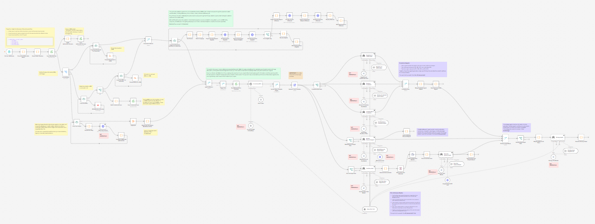
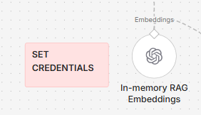

# CommercReady: A Technology Transfer n8n Workflow

<p align="center">
	
</p>

<p align="center">
	Secure, self-hosted pipeline for document redaction, multi-agent evaluation, and commercialization strategy.
</p>

<p align="center">
	
	
	
	
</p>

Self-hosted document intake, multilingual PII redaction, and downstream assessment workflow built with n8n, Microsoft Presidio, and isolated n8n task runners.

The stack is designed for handling confidential files locally. Documents stay inside the mounted `confidential_volume` directory, while Presidio performs English and Chinese entity detection and redaction through internal container-to-container calls.

## Important Disclaimer

- This workflow does not guarantee that generated analysis, summaries, redaction outcomes, or report content are accurate, complete, or legally sufficient.
- All outputs must be reviewed and validated by qualified human reviewers before any operational, legal, regulatory, or investment decision is made.

## License

This repository is licensed under the Apache License 2.0. See [LICENSE](LICENSE) for details.

## Why This Project

- Designed for university technology transfer and research commercialization workflows
- Keeps confidential source documents local, while agents operate on redacted outputs
- Combines deterministic scoring logic with AI synthesis for better auditability
- Supports selective services (`Project Evaluation`, `Market Research`, `Prior Arts`) and full-run strategy mode

## Quick Start Path

1. Complete [Setup](#setup) and launch the stack with Docker Compose.
2. Import the workflow JSON in [Import Workflow to n8n](#6-import-workflow-to-n8n).
3. Configure credentials in [Configure n8n Credentials](#7-configure-n8n-credentials).
4. Review [Workflow Usage](#workflow-usage) for folder structure and operator flow.
5. Read [Evaluation Logic](#evaluation-logic) and the detailed [Project_Evaluation_Business_Logic.md](Project_Evaluation_Business_Logic.md).

## Functionality Overview

This project is designed as a practical research-commercialization engine for technology transfer offices, incubators, and university research teams. It turns a confidential project submission into a structured evaluation package without sending raw source files directly into downstream AI analysis.

At a high level, the workflow:

- ingests project metadata and uploaded supporting files from a submission form
- lets operators selectively request project evaluation, market research, and prior arts analysis
- treats strategy as a full-run option that executes the upstream analysis required for final synthesis
- separates and preserves confidential originals inside a controlled local volume
- processes images, office documents, and text-based PDFs into machine-readable content
- flags scanned PDFs that need an additional conversion or OCR step
- redacts personally identifiable information in both English and Chinese before any AI assessment step
- builds an in-memory RAG layer over redacted content only
- runs parallel AI agents for project evaluation, market research, prior arts analysis, and commercialization strategy
- computes a deterministic readiness outcome from structured scoring logic rather than relying on freeform model judgment alone
- produces reviewer-ready deliverables such as assessment reports, market research reports, prior arts reports, and strategy plans

The result is a workflow that is useful not only for automation, but also for governance. It keeps raw documents compartmentalized, separates deterministic scoring from LLM synthesis, and produces outputs that are easier to audit, review, and hand off to internal decision-makers.

## Sample Data Disclosure

The repository includes a disclosed sample folder at `sample_UrbanAir_AI` for demonstration and testing.

Important disclosure:

- the "Supporting documents" in this sample set are fabricated content generated using Grok 4.3
- they are provided for workflow demonstration only and should not be treated as real company records, legal filings, or factual evidence

How to use the sample:

- users can review the sample outputs to see both redaction capabilities and generated HTML reports
- the sample outputs were generated by submitting all supporting documents to the workflow
- users can also submit only a few documents to observe how redaction behavior and report content change with partial inputs

## Workflow Overview

The image below shows the end-to-end n8n workflow canvas at a high level, including intake, document processing, redaction, RAG construction, parallel service branches, scoring, and strategy generation.



Service selection works as follows:

- `Project Evaluation`, `Market Research`, and `Prior Arts` can be requested independently
- `Strategy` is not treated as a standalone light-weight branch; when it is selected, the workflow executes the upstream analysis needed to produce the final strategy output

## Evaluation Logic

The project evaluation flow is based on a multi-stage business process described in [Project_Evaluation_Business_Logic.md](Project_Evaluation_Business_Logic.md). That document explains the end-to-end workflow in more detail, including:

- submission intake and folder creation
- multi-format document processing and PII redaction
- in-memory RAG construction over redacted files
- parallel evaluation, market research, and prior arts branches
- weighted scoring, translation-risk penalties, and recommendation logic
- strategy synthesis and report generation

If you want to understand how the scoring and branching decisions work, that document should be treated as the primary reference.

## What This Project Includes

- `n8n`: workflow orchestration and UI
- `presidio-analyzer`: custom Presidio analyzer image with Chinese spaCy support and Hong Kong specific recognizers
- `presidio-anonymizer`: redaction service used after entity detection
- `n8n-runner`: external task runner container for isolated code execution
- `confidential_volume`: local document storage for submissions, redacted outputs, assessments, and strategy reports

## Project Structure

```text
.
|-- docker-compose.yml
|-- Dockerfile.n8n
|-- Dockerfile.presidio
|-- Dockerfile.runner
|-- .env.template
|-- config/
|   `-- analyzer.yaml
|-- recognizers/
|   |-- startup.py
|   |-- hk_patterns.py
|   `-- data/
|-- n8n-task-runners.json
`-- confidential_volume/
```

## Setup

### 1. Install Docker Desktop

This project is intended to run through Docker Desktop on Windows.

1. Go to https://www.docker.com/products/docker-desktop/.
2. Download Docker Desktop for Windows.
3. Run the installer and allow the required Windows features if prompted.
4. Start Docker Desktop and wait until it shows that Docker is running.

Recommended checks:

```powershell
docker --version
```

If Docker Desktop starts correctly, that command should return the installed Docker version.

### 2. Verify Docker Compose

On current Docker Desktop releases, Docker Compose is usually included as the `docker compose` plugin. In most cases you do not install it separately.

Check that it is available:

```powershell
docker compose version
```

If that command fails:

1. Update Docker Desktop to the latest version.
2. Reopen the terminal after Docker Desktop finishes updating.
3. Run `docker compose version` again.

This repository uses `docker compose`, not the older `docker-compose` binary.

### 3. Prepare the Environment File

Copy the template file:

```powershell
Copy-Item .env.template .env
```

Then edit `.env` and set the values you need. At minimum, review these entries:

- `N8N_EDITOR_BASE_URL`: base URL for your local n8n editor, normally `http://localhost:5678`
- `N8N_RUNNERS_AUTH_TOKEN`: shared secret between `n8n` and `n8n-runner`
- `GENERIC_TIMEZONE`: default timezone for schedules and timestamps
- `PRESIDIO_ANALYZER_URL`: internal analyzer service URL
- `PRESIDIO_ANONYMIZER_URL`: internal anonymizer service URL

### 4. Review the Local Data Mount

The repository mounts `./confidential_volume` into the containers at `/data/confidential`.

This is the main working directory for sensitive project files. Keep in mind:

- input and generated outputs live on your local machine
- containers read and write directly to this folder
- the n8n configuration restricts file access to this path

### 5. Build and Start the Stack

From the repository root, run:

```powershell
docker compose up --build
```

Notes:

- the first build can take longer because the custom Presidio image downloads the Chinese spaCy model
- the n8n editor is exposed on `http://localhost:5678`
- Presidio analyzer is exposed on `http://localhost:5002`
- Presidio anonymizer is exposed on `http://localhost:5001`

To stop the stack:

```powershell
docker compose down
```

To stop the stack and remove the named volume used for n8n state:

```powershell
docker compose down -v
```

### 6. Import Workflow to n8n

This project workflow definition is stored in `CommercReady.json`.

Import steps in n8n:

1. Open the n8n editor (`http://localhost:5678`).
2. Create a new workflow.
3. Use `Import from File`.
4. Select `Project_Evaluation.json` from the repository root.
5. Save the workflow after import.

After importing, continue with credential setup before running tests or production submissions.

### 7. Configure n8n Credentials

After the stack is running, open the n8n editor and create the credentials required by the workflow.

Important note:

- red sticky notes on the workflow canvas are placed next to the nodes that require credentials
- make sure each marked node is connected to the correct n8n credential type, because several nodes use similar providers through different node types

Example marker on the workflow canvas:



#### Credential 1: `openRouterApi` for `OpenRouter account`

This credential is used by all LangChain chat-model nodes that power the main AI agents.

Create it in n8n:

1. Go to `Credentials`.
2. Select `New`.
3. Choose `OpenRouter API`.
4. Paste your OpenRouter API key from `https://openrouter.ai/keys`.
5. Name it something like `OpenRouter account`.

Nodes that should use this credential:

- `Technology Readiness Chat Model`: powers the Tech Readiness Evaluation Agent for TRL, IPRL, TMRL, and FRL scoring
- `Business Evaluation Chat Model`: powers the Business Evaluation Agent for CRL, BRL, and MRL scoring
- `Regulatory & Certification Chat Model`: powers the Regulatory & Certification Strategy Agent for RRL scoring
- `Market Research Chat Model`: powers the Market Research Agent
- `Tech Describer Chat Model`: powers the Tech Describer Agent
- `Prior Arts Chat Model`: powers the Prior Arts Analysis Agent
- `Strategy Chat Model`: powers the Strategy Agent

#### Credential 2: `openAiApi` for `OpenAI account`

This credential is used by the embeddings node only.

Create it in n8n:

1. Go to `Credentials`.
2. Select `New`.
3. Choose `OpenAI API`.
4. Fill in your API key and, if needed, a custom base URL.
5. Name it something like `OpenAI account`.

Node that should use this credential:

- `In-memory RAG Embeddings`: generates vector embeddings for the redacted document corpus used by the in-memory RAG store

This credential can point to:

- OpenAI directly, such as `api.openai.com`
- an OpenRouter OpenAI-compatible embeddings endpoint
- Azure OpenAI
- another OpenAI-compatible endpoint

The actual embeddings model is selected in the node configuration, not in the credential itself.

#### Credential 3: `httpBearerAuth` for `Bearer Auth account`

This credential is used by raw HTTP request nodes that call OpenRouter directly instead of using a LangChain chat-model node.

Create it in n8n:

1. Go to `Credentials`.
2. Select `New`.
3. Choose `Bearer Auth`.
4. Paste your OpenRouter API key as the bearer token.
5. Name it something like `Bearer Auth account`.

Nodes that should use this credential:

- `LLM Image Analysis`: calls a multimodal OpenRouter model for image description, visible text extraction, and figure analysis
- `Web Search Tool`: calls an OpenRouter-backed web-search model used by the Market Research Agent

Even though this uses the `Bearer Auth` credential type, the token value should still be your OpenRouter API key. These nodes send an `Authorization: Bearer <key>` header, which is what OpenRouter expects.

#### Credential Summary

| Credential name example | n8n credential type | Used by | Purpose                                                |
| ----------------------- | ------------------- | ------- | ------------------------------------------------------ |
| `OpenRouter account`  | `openRouterApi`   | 7 nodes | LangChain chat models for all main AI agents           |
| `OpenAI account`      | `openAiApi`       | 1 node  | Embeddings for the in-memory RAG vector store          |
| `Bearer Auth account` | `httpBearerAuth`  | 2 nodes | Raw HTTP calls to OpenRouter for vision and web search |

#### Nodes That Do Not Need Credentials

These nodes may look like external integrations, but they do not require separate n8n credentials in the current workflow:

- `Presidio Analyze` and `Presidio Anonymize` nodes for English and Chinese: these call your local Presidio services and do not have auth configured by default
- `Google Patent HTTP Tool`: uses a public endpoint and does not require auth in the current setup
- `Read/Write File` nodes: these operate on the local filesystem
- `Form Trigger` and `Wait` nodes: these are native n8n workflow nodes

## Workflow Usage

### How the Working Folder Is Organized

The main operational data lives inside `confidential_volume`.

At the top level:

- `confidential_volume/`: root local storage mounted into the containers as `/data/confidential`
- `confidential_volume/demo.txt`: simple sample file for quick testing or mount verification
- `confidential_volume/<submission_id>_<project_name>/`: one complete working folder for a single submission

Each submission folder acts as the full lifecycle record for one technology transfer case. The folder name is intended to combine a unique submission identifier with a project label so each case is easy to trace and keep separate.

This pattern makes it easier to separate submissions, track processing order, and keep all generated outputs grouped with the original source material.

### What Each Submission Folder Is For

Each submission folder is divided into numbered stages.

#### `00_Admin`

Administrative and intake metadata for the submission.

Typical contents:

- `submission_info.json`: structured intake metadata such as project title, category, timestamp, inventor details, consent flag, and submitted file list
- `technology_summarization.txt`: plain-language technology summary generated by the `Tech Describer` / `Generate Summarization` flow and stored in `00_Admin` when the selected service includes `Strategy` or `Prior Arts`; used by university staff for prior-art searching (for example, CAS SciFinder Prior Art)
- `scanned_pdf.json`: generated only when uploaded PDF(s) are scanned and text cannot be extracted directly; lists the PDF files that require conversion or OCR handling

Use this folder for:

- storing intake metadata
- preserving workflow audit context
- saving service-dependent project summaries generated early in the process
- flagging scanned PDFs that need a separate conversion step before downstream analysis

#### `01_Original`

Original uploaded files before redaction or downstream transformation.

Use this folder for:

- source `.docx`, `.pdf`, images, and other raw submission files
- preserving the exact unmodified inputs
- keeping a clean separation between confidential originals and later outputs

This folder should be treated as the most sensitive content area in the workflow.

#### `02_Redacted`

Redacted or transformed versions of the original documents.

Typical contents include:

- redacted markdown exports of business plans, team profiles, regulatory documents, and technical descriptions
- image analysis notes generated after processing uploaded figures or scans

Use this folder for:

- storing documents after PII detection and anonymization
- generating safer working copies for internal review
- preparing material for assessment steps that should not depend on raw personal data

#### `03_Assessment`

Analytical outputs used to evaluate the submission.

Typical contents include:

- market research reports
- prior art analysis reports
- category-specific assessment reports

Use this folder for:

- storing evaluation artifacts generated from the redacted documents
- collecting decision-support reports for reviewers
- separating analysis deliverables from strategy recommendations

#### `04_Strategy`

Final strategy or action-planning outputs derived from the assessment stage.

Typical contents include:

- strategy plan HTML reports
- commercialization or transfer recommendations
- next-step decision documents for internal stakeholders

Use this folder for:

- storing the highest-level recommendation outputs
- preparing handoff material for business or technology transfer review
- keeping strategic conclusions distinct from raw analysis reports

### Recommended End-to-End Flow

The folder numbering reflects the intended processing order:

1. Intake metadata and summary are created in `00_Admin`.
2. Uploaded confidential source files are stored in `01_Original`.
3. Presidio-based redaction and transformation outputs are written to `02_Redacted`.
4. Assessment workflows generate reports into `03_Assessment`.
5. Final recommendation and planning outputs are written to `04_Strategy`.

This structure keeps each submission traceable from intake to final recommendation while preserving a clear boundary between original confidential material and derived working outputs.

### Prior Arts Excel Submission

If the workflow includes `Prior Arts` directly, or if `Strategy` is selected and therefore triggers the full upstream run, the process will pause at the wait node for prior-arts submission.

Important operator notes:

- the wait node does not automatically pop up the submission form
- open the wait node inside n8n and click the `Webform` link shown on the right-side panel
- create a new Excel file for the patent list
- place all patent publication numbers in column `A` only
- enter one publication number per row
- there is no need to rename the worksheet

Example format:


## Customization

### Environment Customization

Use `.env` to control runtime behavior without editing container definitions. Common adjustments include:

- execution retention and pruning settings for n8n
- cookie security and editor URL settings
- external runner authentication and resource behavior
- Presidio endpoint variables used by your workflows

If you change `.env`, restart the stack:

```powershell
docker compose up -d --build
```

### Presidio Language and Model Configuration

The file `config/analyzer.yaml` defines the supported languages and NLP models used by the analyzer service.

Current configuration:

- English: `en_core_web_lg`
- Chinese: `zh_core_web_lg`

Change this file if you need to add or remove supported languages or swap model choices.

### Custom Recognizers

The `recognizers` folder contains the custom Presidio logic for project-specific detection behavior.

Important files:

- `recognizers/startup.py`: boots the analyzer service and registers custom recognizers
- `recognizers/hk_patterns.py`: custom Hong Kong pattern recognizers
- `recognizers/result_filter.py`: post-processing and filtering logic
- `recognizers/data/`: CSV-driven rules and lookup data

Use this area when you need to customize:

- organization-specific keywords
- Hong Kong ID or local format detection
- Chinese name handling
- entity alias normalization or result filtering

Because `recognizers` is mounted into the analyzer container, code and data changes do not require rebuilding the image. In practice, you should restart the analyzer service after changes so the Python process reloads the updated logic:

```powershell
docker compose restart presidio-analyzer
```

### n8n Runner Customization

The file `n8n-task-runners.json` controls the external task runner configuration used by n8n.

This is where you can adjust:

- allowed environment variables
- per-runner command configuration
- JavaScript and Python runner restrictions
- health-check ports

Change this carefully. Restrictive defaults are part of the security model for isolated execution.

### Docker Service Customization

Use `docker-compose.yml` when you need to change:

- published ports
- mounted directories
- resource limits
- service dependencies
- health checks

Use the Dockerfiles when you need to change image contents:

- `Dockerfile.presidio`: install models, Python packages, or custom analyzer assets
- `Dockerfile.n8n`: extend the n8n base image
- `Dockerfile.runner`: change runner image behavior or bundled configuration

After editing Dockerfiles or Compose service definitions, rebuild:

```powershell
docker compose up --build
```

## Troubleshooting

### Docker Compose command is not found

- make sure Docker Desktop is installed and running
- open a new terminal after installation or upgrade
- run `docker compose version` again

### n8n does not open on localhost:5678

- confirm the containers are running with `docker compose ps`
- inspect startup logs with `docker compose logs n8n`
- verify that port `5678` is not already in use

### Presidio analyzer fails on first startup

The first startup may be slow because the Chinese model is loaded during image build and container initialization. If the container exits, inspect logs:

```powershell
docker compose logs presidio-analyzer
```

## Security Notes

- confidential documents are mounted from the local `confidential_volume` directory
- file access inside n8n is restricted to `/data/confidential`
- code execution is isolated through external task runners
- custom recognizers and local data should be reviewed before sharing this repository or its outputs

## Credits and References

The evaluation design described in this repository builds on published frameworks and upstream tools rather than inventing its assessment model from scratch.

Methodology references:

- `KTH Innovation Readiness Level (IRL)` by KTH Innovation / KTH Royal Institute of Technology: source for the core readiness dimensions such as TRL, IPRL, TMRL, FRL, CRL, and BRL
- `TT&E Framework` by Sebastian (2026): source for Market Readiness Level and the translation-risk concept used to compare technology maturity against market maturity
- `Kobos Technology Roadmap (TRM) framework` by Kobos et al.: source for the regulatory traction and policy-support perspective used in regulatory readiness analysis

Platform and implementation credits:

- `n8n`: workflow orchestration and form-driven automation
- `Microsoft Presidio`: PII detection and anonymization foundation for the bilingual redaction pipeline
- `spaCy`: NLP model runtime used by the custom Presidio analyzer configuration

Detailed workflow reasoning and methodology attribution are documented in [Project_Evaluation_Business_Logic.md](Project_Evaluation_Business_Logic.md).
